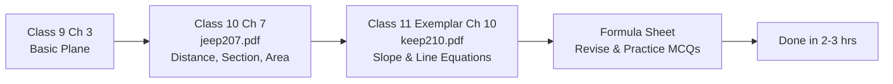

---
title: "BPSC TGT Math: निर्देशांक ज्यामिति एवं सरल रेखाएँ — दूरी सूत्र, विभाजन सूत्र, ढाल और y=mx+c (2.2% Weightage)"
slug: bpsc-tgt-math-coordinate-geometry-straight-lines
description: "BPSC TGT गणित: निर्देशांक ज्यामिति के सभी फॉर्मूले — दूरी, विभाजन, ढाल, सरल रेखा समीकरण और परीक्षा रणनीति।"
date: 2026-08-21
series: "BPSC TGT Math Master Series"
article_no: 10
prev_article: "Article 09 — Statistics (सांख्यिकी)"
next_article: "Article 11 — Number System & Arithmetic Progression"
robots: "noindex, follow"
lang: hi
---

# BPSC TGT Math — निर्देशांक ज्यामिति एवं सरल रेखाएँ (Coordinate Geometry & Straight Lines)

> [!IMPORTANT]
> **Executive Summary:** BPSC TGT में निर्देशांक ज्यामिति से **12 प्रश्न (2.2% Weightage)** आते हैं। यह Low-Priority topic है — केवल **NCERT Class 9 Ch 3, Class 10 Ch 7 और Class 11 Exemplar Ch 10** पढ़ें। **सूत्र याद करें, गहरे मत जाएँ। 2-3 घंटे पर्याप्त हैं।**

---

## 1. मुख्य बिंदु / Key Breakdown

### BPSC TGT में Weightage एवं NCERT Source Mapping

| विवरण | विस्तार |
|---|---|
| **कुल प्रश्न** | 12 (2.2% of total) |
| **प्राथमिकता स्तर** | 🟡 Low Priority |
| **NCERT Source 1** | Class 9, Chapter 3 — Coordinate Geometry (मूल अवधारणाएँ) |
| **NCERT Source 2** | Class 10, Chapter 7 — Coordinate Geometry (`jeep207.pdf`) |
| **NCERT Source 3** | Class 11 Exemplar ONLY, Chapter 10 — Straight Lines (`keep210.pdf`) |
| **अनुशंसित समय** | 2–3 घंटे अधिकतम |
| **प्रश्न प्रकार** | Formula-based application, MCQ |

### पढ़ाई का फ्लोचार्ट (Study Flow)

---

## 2. कोर फॉर्मूला शीट (Core Formula Sheet)

### A. दूरी सूत्र (Distance Formula)

दो बिंदुओं $P(x_1, y_1)$ और $Q(x_2, y_2)$ के बीच की दूरी:

$$d = \sqrt{(x_2 - x_1)^2 + (y_2 - y_1)^2}$$

> **परीक्षा ट्रैप:** मूलबिंदु (Origin) से दूरी = $\sqrt{x^2 + y^2}$ — यह Distance Formula का special case है।

---

### B. विभाजन सूत्र (Section Formula)

**आंतरिक विभाजन (Internal Division)** — जब बिंदु $R$, रेखाखंड $PQ$ को $m_1 : m_2$ में विभाजित करे:

$$R = \left(\frac{m_1 x_2 + m_2 x_1}{m_1 + m_2},\ \frac{m_1 y_2 + m_2 y_1}{m_1 + m_2}\right)$$

**मध्यबिंदु (Midpoint)** — जब $m_1 = m_2 = 1$:

$$M = \left(\frac{x_1 + x_2}{2},\ \frac{y_1 + y_2}{2}\right)$$

> **परीक्षा ट्रैप:** बाह्य विभाजन (External Division) में denominator = $m_1 - m_2$ (negative sign)। Section Formula का सबसे common error यहीं होती है।

---

### C. त्रिभुज का क्षेत्रफल (Area of Triangle)

तीन शीर्षों $A(x_1,y_1)$, $B(x_2,y_2)$, $C(x_3,y_3)$ से बने त्रिभुज का क्षेत्रफल:

$$\text{Area} = \frac{1}{2} \left| x_1(y_2 - y_3) + x_2(y_3 - y_1) + x_3(y_1 - y_2) \right|$$

> **सहरेखता (Collinearity):** यदि तीनों बिंदु एक ही रेखा पर हों, तो Area = 0.

---

### D. ढाल / Slope (m)

$$m = \tan\theta = \frac{y_2 - y_1}{x_2 - x_1}$$

| रेखा की स्थिति | ढाल (Slope) |
|---|---|
| X-axis के समानांतर (Horizontal) | $m = 0$ |
| Y-axis के समानांतर (Vertical) | $m = \text{undefined}$ |
| 45° पर झुकी | $m = 1$ |
| 135° पर झुकी | $m = -1$ |

---

### E. सरल रेखा के समीकरण (Equations of a Straight Line)

| समीकरण रूप (Form) | सूत्र | प्रयोग कब |
|---|---|---|
| **ढाल-अंतःखंड (Slope-Intercept)** | $y = mx + c$ | जब ढाल $m$ और Y-intercept $c$ ज्ञात हो |
| **बिंदु-ढाल (Point-Slope)** | $y - y_1 = m(x - x_1)$ | जब एक बिंदु और ढाल ज्ञात हो |
| **दो-अंतःखंड (Two-Intercept)** | $\dfrac{x}{a} + \dfrac{y}{b} = 1$ | जब X और Y अक्षों पर अंतःखंड ज्ञात हों |
| **सामान्य रूप (General Form)** | $Ax + By + C = 0$ | सार्वत्रिक रूप; slope $= -A/B$ |

---

### F. समांतर और लंब रेखाएँ (Parallel & Perpendicular Lines)

$$\textbf{Parallel Lines (समांतर): } m_1 = m_2$$

$$\textbf{Perpendicular Lines (लंब): } m_1 \times m_2 = -1$$

> **Quick Test:** यदि $y = 2x + 3$ और $y = 2x - 7$ हों, तो दोनों **समांतर** हैं क्योंकि $m_1 = m_2 = 2$।

---

### G. बिंदु से रेखा की लंब दूरी (Perpendicular Distance)

बिंदु $(x_1, y_1)$ से रेखा $Ax + By + C = 0$ की दूरी:

$$d = \frac{|Ax_1 + By_1 + C|}{\sqrt{A^2 + B^2}}$$

> **Class 11 Exemplar (keep210.pdf) में यह सूत्र सबसे अधिक बार पूछा जाता है।**

---

## 3. वास्तविक परीक्षा प्रश्न एवं NCERT मैपिंग (PYQ-style Practice)

### प्रश्न 1 — Distance Formula (Class 10, jeep207.pdf)

बिंदु $A(3, 4)$ और $B(0, 0)$ के बीच की दूरी ज्ञात करें।

**हल:**
$$d = \sqrt{(3-0)^2 + (4-0)^2} = \sqrt{9 + 16} = \sqrt{25} = \mathbf{5}$$

---

### प्रश्न 2 — Section Formula (Class 10, jeep207.pdf)

बिंदु $P(2, 3)$ और $Q(8, 9)$ को जोड़ने वाले रेखाखंड को $2:1$ के अनुपात में आंतरिक रूप से विभाजित करने वाले बिंदु के निर्देशांक ज्ञात करें।

**हल:**
$$R = \left(\frac{2 \times 8 + 1 \times 2}{3},\ \frac{2 \times 9 + 1 \times 3}{3}\right) = \left(\frac{18}{3},\ \frac{21}{3}\right) = \mathbf{(6,\ 7)}$$

---

### प्रश्न 3 — Perpendicular Distance (Class 11 Exemplar, keep210.pdf)

बिंदु $(2, 3)$ से रेखा $3x - 4y + 5 = 0$ की दूरी ज्ञात करें।

**हल:**
$$d = \frac{|3(2) - 4(3) + 5|}{\sqrt{3^2 + (-4)^2}} = \frac{|6 - 12 + 5|}{\sqrt{25}} = \frac{|-1|}{5} = \mathbf{\frac{1}{5}}$$

---

## 4. क्या पढ़ें और क्या छोड़ें (Study vs. Skip Strategy)

| ✅ क्या पढ़ें | ❌ क्या छोड़ें |
|---|---|
| Distance Formula + 5 MCQs | External Division detailed proofs |
| Section Formula (Internal only) | Conic Sections (Circle, Parabola) |
| Midpoint Formula | Family of lines (advanced) |
| Area of triangle + Collinearity | 3D Coordinate Geometry |
| Slope + Parallel/Perpendicular conditions | Transformation of axes |
| $y = mx + c$ और $x/a + y/b = 1$ | Pair of straight lines (Class 12 level) |
| Perpendicular distance formula (keep210.pdf) | Three-line concurrency proofs |

> [!TIP]
> **BPSC Strategy:** यह केवल 2.2% है। Formula Sheet बनाएँ, हर सूत्र पर 2-3 MCQ solve करें और आगे बढ़ें। **Time boxing: 2 घंटे से ज़्यादा नहीं।**

---

## 5. FAQ — अक्सर पूछे जाने वाले प्रश्न

**Q1. क्या BPSC TGT में निर्देशांक ज्यामिति से सीधे formula-based प्रश्न आते हैं?**
हाँ। BPSC TRE के past papers में Distance Formula, Section Formula और Slope-based MCQ directly पूछे गए हैं। ये formula plug-and-play type होते हैं — concept बहुत deep नहीं जाता।

**Q2. ढाल (Slope) और X-axis के बीच कोण का संबंध क्या है?**
$m = \tan\theta$ जहाँ $\theta$ रेखा का X-axis के धनात्मक दिशा से बना कोण है। $\theta = 90°$ पर ढाल undefined होती है — यह Y-axis के समानांतर रेखा है।

**Q3. Section Formula में $m_1$ और $m_2$ का क्रम उलझाता है — सरल trick क्या है?**
याद रखें: **"जो दूर है, उसका coefficient नज़दीक वाले बिंदु के साथ आता है।"** यानी $m_1$ को $x_2$ से और $m_2$ को $x_1$ से गुना करें। यह cross-multiplication pattern है।

**Q4. General form $Ax + By + C = 0$ से slope कैसे निकालें?**
$m = -\frac{A}{B}$। उदाहरण: $3x + 4y - 12 = 0$ में slope $= -3/4$। **सबसे common exam error: sign गलत करना।**

**Q5. तीन बिंदु सहरेखी (Collinear) हैं — यह कैसे check करें?**
Area of triangle formula लगाएँ। यदि area = 0, तो तीनों बिंदु एक ही रेखा पर हैं। यह Class 10 Ch 7 का standard MCQ type है।

**Q6. Two-intercept form $x/a + y/b = 1$ कब use करें?**
जब प्रश्न में X-axis और Y-axis पर intercept (अंतःखंड) दिए हों। $x = a$ पर Y = 0 और $y = b$ पर X = 0 होता है।

**Q7. Class 11 Exemplar (keep210.pdf) से कितने प्रश्न BPSC TGT में expected हैं?**
Straight Lines chapter से मुख्यतः Perpendicular Distance और Line equations के 1-2 प्रश्न expected हैं। बाकी 10 प्रश्न Class 9-10 level के हैं।

**Q8. दो लंब रेखाओं में एक horizontal हो तो $m_1 \times m_2 = -1$ formula काम करता है?**
नहीं। यदि एक रेखा horizontal ($m=0$) और दूसरी vertical (undefined slope) हो, तो ये naturally लंब होती हैं। इस special case में $m_1 \times m_2 = -1$ formula apply नहीं होता।

**Q9. Midpoint Formula और Section Formula में क्या अंतर है?**
Midpoint, Section Formula का special case है जहाँ ratio $1:1$ होता है। Midpoint में दोनों coordinates का सीधा average लेते हैं।

**Q10. BPSC TGT के लिए Class 11 Exemplar Straight Lines पर कितना समय दें?**
**20-30 मिनट पर्याप्त हैं।** केवल Perpendicular Distance formula और 3-4 solved examples देखें। पूरा chapter करने की ज़रूरत नहीं — यह Low Priority topic है।

---

## 6. त्वरित चेकलिस्ट (Quick Action Checklist)

- [ ] Distance Formula याद करें + 5 MCQs solve करें (Class 10 Ch 7, `jeep207.pdf`)
- [ ] Section Formula (Internal Division) समझें + Midpoint practice करें
- [ ] Area of Triangle formula — Collinearity condition note करें
- [ ] Slope formula + Parallel/Perpendicular conditions लिखें
- [ ] $y = mx + c$ और $x/a + y/b = 1$ के 3-3 MCQ करें
- [ ] General form से Slope निकालना practice करें: $m = -A/B$
- [ ] Perpendicular Distance formula (keep210.pdf) — 2 solved examples देखें
- [ ] अपनी Formula Sheet बनाएँ — सभी 7 formulas एक page पर
- [ ] कुल समय: **2-3 घंटे से अधिक नहीं**

---

📌 **अगला आर्टिकल →** Article 11: BPSC TGT Math: संख्या पद्धति एवं समांतर श्रेणी — वास्तविक संख्याएँ, HCF-LCM और AP के सूत्र (2.2% Weightage)