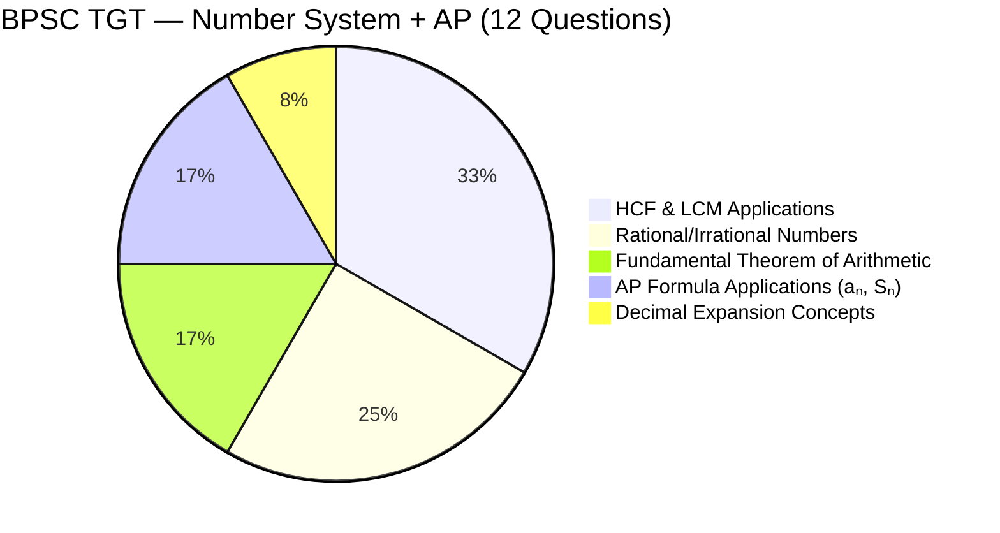
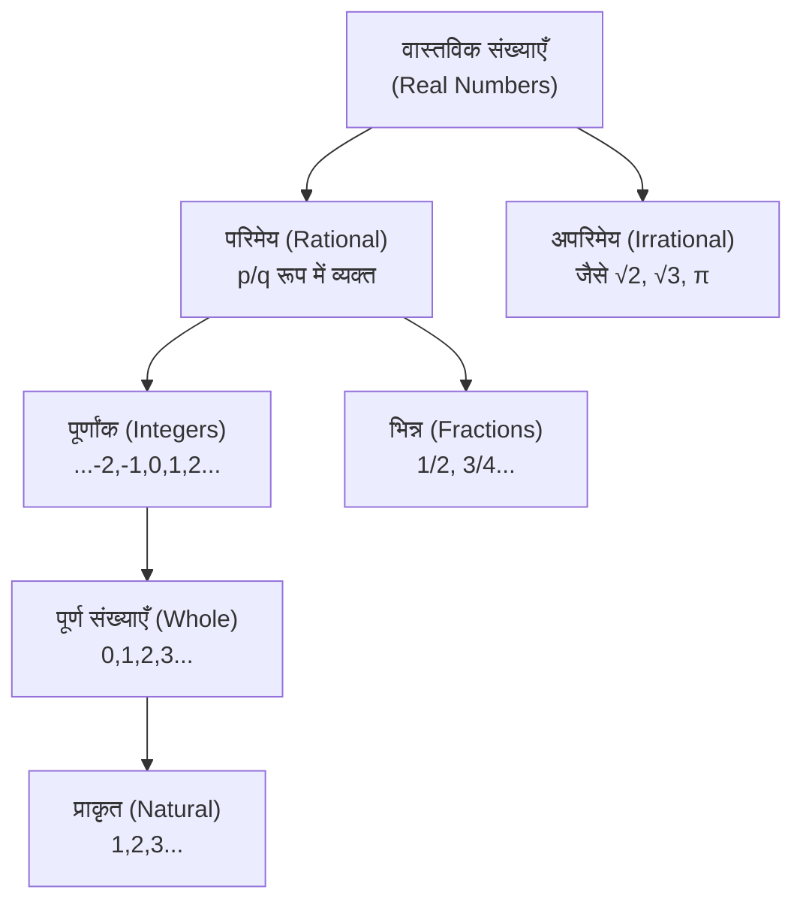

---
title: "BPSC TGT Math: संख्या पद्धति एवं समांतर श्रेणी — वास्तविक संख्याएँ, HCF-LCM और AP के सूत्र (2.2% Weightage)"
slug: bpsc-tgt-math-number-system-arithmetic-progression
description: "BPSC TGT गणित: संख्या पद्धति (HCF, LCM, अभाज्य संख्याएँ) और समांतर श्रेणी (AP) के सभी फॉर्मूले और परीक्षा रणनीति।"
date: 2026-08-21
series: "BPSC TGT Math Master Series"
article_no: 11
prev_article: "Article 10 — Coordinate Geometry & Straight Lines"
next_article: "Article 12 — Class 10 Exemplar Top 50 Direct MCQs"
robots: "noindex, follow"
lang: hi
---

# BPSC TGT Math — संख्या पद्धति एवं समांतर श्रेणी (Number System & Arithmetic Progression)

> [!IMPORTANT]
> **Executive Summary:** BPSC TGT में संख्या पद्धति और AP को मिलाकर **12 प्रश्न (2.2% Weightage)** आते हैं। यह **Low Priority topic** है — HCF/LCM, अपरिमेय संख्याओं की अवधारणा, और AP के दो core formulas याद करें। **NCERT Class 9 Ch 1, Class 10 Ch 1 और Ch 5 पढ़ें। 2-3 घंटे पर्याप्त हैं।**

---

## 1. मुख्य बिंदु / Key Breakdown

### BPSC TGT में Weightage एवं NCERT Source Mapping

| विवरण | विस्तार |
|---|---|
| **कुल प्रश्न** | ~12 (संख्या पद्धति ~11 + AP ~1, 2.2% of total) |
| **प्राथमिकता स्तर** | 🟡 Low Priority |
| **NCERT Source 1** | Class 9, Chapter 1 — Number Systems (`ieep201.pdf`) |
| **NCERT Source 2** | Class 10, Chapter 1 — Real Numbers (`jeep201.pdf`) |
| **NCERT Source 3** | Class 10, Chapter 5 — Arithmetic Progressions (`jeep205.pdf`) |
| **अनुशंसित समय** | 2–3 घंटे अधिकतम |
| **प्रश्न प्रकार** | Concept-based MCQ, formula application |

### टॉपिक वितरण चार्ट (Topic Distribution)

---

## 2. कोर कॉन्सेप्ट्स और फॉर्मूला शीट (Core Concepts & Formulas)

### A. संख्याओं का वर्गीकरण (Classification of Numbers)

---

### B. HCF और LCM (Highest Common Factor & Least Common Multiple)

**सबसे महत्वपूर्ण सूत्र:**

$$\text{HCF}(a, b) \times \text{LCM}(a, b) = a \times b$$

> **यह formula केवल दो संख्याओं के लिए है।** तीन या अधिक संख्याओं के लिए यह directly apply नहीं होता।

**HCF/LCM निकालने की विधि:**

| विधि | कब उपयोग करें |
|---|---|
| **Prime Factorisation** | सबसे reliable; NCERT standard method |
| **Euclid's Division Lemma** | concept पूछे तो जानें; calculation avoid करें |

**Prime Factorisation याद रखें:**
- HCF = **Common prime factors का minimum power**
- LCM = **सभी prime factors का maximum power**

**उदाहरण:** $a = 12 = 2^2 \times 3$, $b = 18 = 2 \times 3^2$
$$\text{HCF} = 2^1 \times 3^1 = 6, \quad \text{LCM} = 2^2 \times 3^2 = 36$$
$$\text{Verify: } 6 \times 36 = 216 = 12 \times 18 \checkmark$$

---

### C. अंकगणित की मौलिक प्रमेय (Fundamental Theorem of Arithmetic)

> **"हर 1 से बड़ा पूर्णांक (Integer > 1) या तो अभाज्य (Prime) है, या अभाज्य संख्याओं के एकमात्र गुणनखंड (Unique Product of Primes) के रूप में लिखा जा सकता है।"**

- **परीक्षा में पूछा जाता है:** इस theorem का statement, और इसका HCF/LCM से connection।
- **Unique Factorisation:** $180 = 2^2 \times 3^2 \times 5$ — यह factorisation unique है (क्रम अलग हो सकता है)।

---

### D. अपरिमेय संख्याओं की अपरिमेयता का प्रमाण (Proof of Irrationality)

**$\sqrt{2}$ अपरिमेय है — Contradiction Method (अवधारणा जानें, steps नहीं):**

1. मान लें $\sqrt{2} = p/q$ (lowest terms में)
2. तो $2q^2 = p^2$ → $p^2$ सम है → $p$ सम है → $p = 2m$
3. $2q^2 = 4m^2$ → $q^2 = 2m^2$ → $q$ भी सम है
4. यह विरोधाभास है (p और q दोनों सम नहीं हो सकते lowest terms में)
5. अतः $\sqrt{2}$ अपरिमेय है ✓

> **BPSC TGT में:** Proof की steps नहीं पूछी जातीं — केवल **"$\sqrt{2}$ अपरिमेय क्यों है?"** concept MCQ में पूछा जाता है। इसी method से $\sqrt{3}$ और $\sqrt{5}$ की irrationality सिद्ध होती है।

---

### E. दशमलव प्रसार (Decimal Expansion)

| प्रकार | शर्त | उदाहरण |
|---|---|---|
| **सांत दशमलव (Terminating)** | हर = $2^m \times 5^n$ (केवल 2 और 5 के गुणनखंड) | $3/8 = 0.375$ |
| **असांत आवर्ती (Non-terminating Recurring)** | हर में 2, 5 के अलावा अन्य prime factor | $1/3 = 0.333...$ |
| **असांत अनावर्ती (Non-terminating Non-recurring)** | अपरिमेय संख्याएँ | $\sqrt{2} = 1.41421...$ |

> **BPSC Exam Trick:** यदि हर को $2^m \times 5^n$ रूप में लिखा जा सके तो decimal **सांत (Terminating)** होगा।

---

### F. समांतर श्रेणी — AP (Arithmetic Progression)

**AP की परिभाषा:** वह अनुक्रम जिसमें हर पद का अंतर (Common Difference, $d$) समान हो।

$$d = a_2 - a_1 = a_3 - a_2 = \text{constant}$$

**दो महत्वपूर्ण सूत्र:**

**1. n वाँ पद (nth Term):**
$$a_n = a + (n-1)d$$

**2. n पदों का योग (Sum of n Terms):**
$$S_n = \frac{n}{2} \left[ 2a + (n-1)d \right] = \frac{n}{2}(a + l)$$

जहाँ $a$ = प्रथम पद (first term), $d$ = सार्वअंतर (common difference), $l$ = अंतिम पद (last term), $n$ = पदों की संख्या।

**3. दो संख्याओं का समांतर माध्य (Arithmetic Mean):**
$$\text{AM} = \frac{a + b}{2}$$

**AP Formula Application Table:**

| प्रश्न प्रकार | उपयोग करें |
|---|---|
| किसी AP का n वाँ पद ज्ञात करें | $a_n = a + (n-1)d$ |
| किसी AP का योग ज्ञात करें | $S_n = n/2 \times [2a + (n-1)d]$ |
| AP का अंतिम पद ज्ञात हो, योग निकालें | $S_n = n/2 \times (a + l)$ |
| तीन पद AP में हैं — सिद्ध करें | $2b = a + c$ check करें |

---

## 3. वास्तविक परीक्षा प्रश्न एवं NCERT मैपिंग (PYQ-style Practice)

### प्रश्न 1 — HCF × LCM (Class 10, jeep201.pdf)

दो संख्याओं का HCF 9 है और LCM 270 है। यदि एक संख्या 45 है, तो दूसरी ज्ञात करें।

**हल:**
$$a \times b = \text{HCF} \times \text{LCM}$$
$$45 \times b = 9 \times 270 = 2430$$
$$b = \frac{2430}{45} = \mathbf{54}$$

---

### प्रश्न 2 — AP का n वाँ पद (Class 10, jeep205.pdf)

AP: $3, 7, 11, 15, \ldots$ का 20वाँ पद ज्ञात करें।

**हल:**
$$a = 3,\quad d = 7-3 = 4,\quad n = 20$$
$$a_{20} = 3 + (20-1) \times 4 = 3 + 76 = \mathbf{79}$$

---

### प्रश्न 3 — AP का योग (Class 10, jeep205.pdf)

AP: $2, 5, 8, 11, \ldots$ के प्रथम 15 पदों का योग ज्ञात करें।

**हल:**
$$a = 2,\quad d = 3,\quad n = 15$$
$$S_{15} = \frac{15}{2}\left[2(2) + (15-1)(3)\right] = \frac{15}{2}\left[4 + 42\right] = \frac{15 \times 46}{2} = \mathbf{345}$$

---

### प्रश्न 4 — Decimal Expansion Type (Class 10, jeep201.pdf)

$\frac{17}{125}$ का दशमलव प्रसार सांत होगा या असांत? क्यों?

**हल:** $125 = 5^3 = 2^0 \times 5^3$ → हर में केवल 5 है → **सांत दशमलव (Terminating)**
$$\frac{17}{125} = \frac{17 \times 2^3}{5^3 \times 2^3} = \frac{136}{1000} = 0.136$$

---

## 4. क्या पढ़ें और क्या छोड़ें (Study vs. Skip Strategy)

| ✅ क्या पढ़ें | ❌ क्या छोड़ें |
|---|---|
| HCF × LCM = a × b formula + applications | Euclid's Division Algorithm detailed steps |
| Prime Factorisation method (HCF/LCM निकालना) | Geometric Progression (GP) — not in Class 10 NCERT scope |
| Rational/Irrational number concept | Harmonic Progression (HP) |
| Irrationality proof concept (√2, √3, √5) | Number theory advanced proofs |
| Decimal expansion: Terminating conditions | Permutations/Combinations (different chapter) |
| AP: $a_n = a + (n-1)d$ | Sigma notation (Class 11 level) |
| AP: $S_n = n/2 \times [2a + (n-1)d]$ | Sum of GP, infinite series |
| Arithmetic Mean formula | AGM inequality proofs |

> [!WARNING]
> **GP (Geometric Progression) न पढ़ें** — यह Class 10 NCERT TGT scope से बाहर है। Class 11 का topic है। BPSC TGT syllabus में नहीं है।

---

## 5. FAQ — अक्सर पूछे जाने वाले प्रश्न

**Q1. BPSC TGT में HCF और LCM से किस प्रकार के प्रश्न पूछे जाते हैं?**
मुख्यतः word problem type — जैसे: "दो संख्याओं का HCF और LCM दिया है, एक संख्या ज्ञात करें।" Formula: HCF × LCM = a × b। ये straightforward MCQs हैं।

**Q2. Rational और Irrational numbers में अंतर याद रखने का सरल तरीका क्या है?**
**Rational (परिमेय):** $p/q$ form में लिखा जा सके जहाँ $q \neq 0$। दशमलव या तो सांत (terminate) होगा या repeating होगा। **Irrational (अपरिमेय):** $\sqrt{2}, \sqrt{3}, \pi$ — दशमलव non-terminating और non-repeating होता है।

**Q3. क्या $\sqrt{4}$ irrational है?**
**नहीं।** $\sqrt{4} = 2$ — यह एक पूर्णांक है, अतः rational है। Irrational वे perfect squares की roots नहीं हैं: $\sqrt{2}, \sqrt{3}, \sqrt{5}, \sqrt{6}, \sqrt{7}$ आदि।

**Q4. Terminating decimal के लिए denominator की condition क्या है?**
हर (Denominator) को lowest terms में $2^m \times 5^n$ रूप में लिखा जा सके। यदि हर में 2 और 5 के अलावा कोई अन्य prime factor (जैसे 3, 7, 11) हो, तो decimal non-terminating repeating होगा।

**Q5. AP में common difference negative हो सकती है?**
हाँ। जैसे: $20, 15, 10, 5, \ldots$ में $d = -5$ है। यह Decreasing AP है। Formula $a_n = a + (n-1)d$ वही रहता है।

**Q6. तीन consecutive terms AP में हों — इसे कैसे represent करें?**
$a-d, a, a+d$ — इस form में लें। इससे sum और product निकालना बहुत आसान हो जाता है।

**Q7. Euclid's Division Algorithm कितना important है BPSC TGT के लिए?**
**Concept जानें, detailed steps नहीं।** Algorithm का statement ("For any two positive integers a and b, $a = bq + r$") MCQ में पूछा जा सकता है। लेकिन इसे use करके HCF निकालने की practice BPSC के लिए ज़रूरी नहीं।

**Q8. Arithmetic Mean (AM) और AP का middle term क्या relationship है?**
यदि $a, b, c$ AP में हैं, तो $b = \frac{a+c}{2}$ अर्थात b, a और c का Arithmetic Mean है। यह property बहुत काम आती है जब कहा जाए "तीन पद AP में हैं।"

**Q9. क्या GP (Geometric Progression) BPSC TGT में पूछा जाता है?**
**नहीं।** GP Class 11 NCERT का topic है और BPSC TGT (Class 9-10 syllabus based) में scope से बाहर है। इसे बिल्कुल skip करें।

**Q10. इस topic पर कितना समय लगाएँ?**
**Number System के लिए 1.5 घंटे + AP के लिए 1 घंटा = कुल 2.5 घंटे पर्याप्त हैं।** HCF/LCM पर ज़्यादा focus करें क्योंकि वहाँ से directly formula-based MCQs आते हैं।

---

## 6. त्वरित चेकलिस्ट (Quick Action Checklist)

- [ ] संख्याओं का वर्गीकरण (Real → Rational → Integer → Natural) एक diagram में लिखें
- [ ] HCF × LCM = a × b formula याद करें + 5 MCQs solve करें
- [ ] Prime Factorisation से HCF और LCM निकालना practice करें
- [ ] Fundamental Theorem of Arithmetic का statement note करें
- [ ] Terminating decimal condition: denominator = $2^m \times 5^n$ — 3 examples करें
- [ ] √2 irrational है — Contradiction method का concept (steps नहीं) समझें
- [ ] AP formula: $a_n = a + (n-1)d$ — 5 MCQs solve करें (`jeep205.pdf`)
- [ ] AP sum: $S_n = n/2 \times [2a + (n-1)d]$ — 5 MCQs solve करें
- [ ] GP बिल्कुल skip करें (out of scope)
- [ ] कुल समय: **2-3 घंटे से अधिक नहीं**

---

📌 **अगला आर्टिकल →** Article 12: NCERT Class 10 Exemplar Maths: BPSC TGT में सीधे पूछे गए Top 50 MCQs — Chapter-wise with Solutions