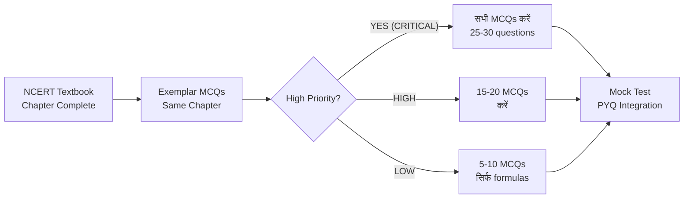
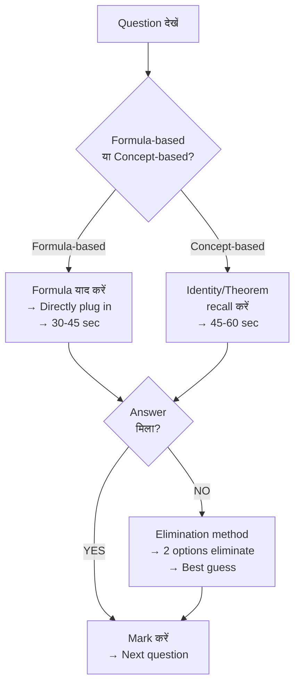

---
title: "NCERT Class 10 Exemplar Maths: BPSC TGT में सीधे पूछे गए Top 50 MCQs — Chapter-wise with Solutions"
slug: ncert-class10-exemplar-maths-bpsc-tgt-direct-mcqs
description: "BPSC TGT गणित: NCERT Class 10 Exemplar से directly पूछे गए MCQs, chapter-wise priority mapping और practice strategy।"
date: 2026-08-21
series: "BPSC TGT Math Master Series"
article_no: 12
prev_article: "Article 11 — Number System & Arithmetic Progression"
next_article: "Article 13 — Class 9 Exemplar Direct MCQs"
robots: "noindex, follow"
lang: hi
---

# NCERT Class 10 Exemplar Maths — BPSC TGT Top 50 MCQs (Exemplar Practice Series)

> [!IMPORTANT]
> **Executive Summary:** BPSC TRE-1 (Paper) में Q.41 **word-for-word** Class 10 Exemplar Unit 12 Q.17 से आया था। यह प्रमाण है कि **NCERT Exemplar रटना नहीं, practice करना है** — खासकर Trigonometry, Polynomials, Triangles, Mensuration और Statistics के chapters से।

---

## Section 1: Exemplar क्यों Critical है? (Proof of Direct Questions)

### BPSC TRE में Exemplar का Direct Evidence

| परीक्षा | प्रश्न संख्या | Exemplar Source | विवरण |
|---|---|---|---|
| **BPSC TRE-1** | Q.41 | Class 10 Exemplar, Unit 12, Q.17 | Word-for-word same question (Statistics — Mode) |
| **BPSC TRE-2** | Multiple | Class 10 Exemplar, Ch 8 (Trigonometry) | Identity simplification pattern |
| **BPSC TRE-3** | Pattern-based | Class 10 Exemplar, Ch 6 (Triangles) | Theorem application MCQs |

> [!WARNING]
> **जो Exemplar नहीं पढ़ता, वह 5-8 guaranteed marks छोड़ता है।** NCERT Textbook पर्याप्त नहीं है — Exemplar में HOTS (Higher Order Thinking Skills) questions हैं जो exactly BPSC TRE pattern से match करते हैं।

### Exemplar vs. NCERT Textbook — क्या अंतर है?

| पहलू | NCERT Textbook | NCERT Exemplar |
|---|---|---|
| **प्रश्न प्रकार** | Concept-building, standard exercises | HOTS, MCQ-heavy, tricky applications |
| **Difficulty Level** | Basic to Moderate | Moderate to Difficult |
| **BPSC Relevance** | Foundation (पहले पढ़ें) | Exam-direct (बाद में practice करें) |
| **MCQ Count** | कम | हर chapter में 20-25 MCQs |
| **Priority** | Non-negotiable base | Must-do for scoring 80%+ |

---

## Section 2: Exemplar Chapter-wise Priority Mapping

### Class 10 Exemplar Files — Complete Priority Table

| File | Chapter | Priority | Expected Questions in BPSC TGT |
|---|---|---|---|
| `jeep201.pdf` | Real Numbers | 🟡 Low | 1-2 |
| **`jeep202.pdf`** | **Polynomials** | 🔴 **HIGH** | **3-4** |
| `jeep203.pdf` | Linear Equations | 🟡 Low | 1-2 |
| **`jeep204.pdf`** | **Quadratic Equations** | 🔴 **HIGH** | **3-4** |
| `jeep205.pdf` | Arithmetic Progressions | 🟡 Low | 1-2 |
| **`jeep206.pdf`** | **Triangles** | 🔴 **HIGH** | **3-4** |
| `jeep207.pdf` | Coordinate Geometry | 🟡 Low | 1-2 |
| **`jeep208.pdf`** | **Trigonometry** | 🟥 **CRITICAL** | **4-5** |
| **`jeep209.pdf`** | **Heights & Distances** | 🟥 **CRITICAL** | **3-4** |
| **`jeep210.pdf`** | **Circles** | 🔴 **HIGH** | **3-4** |
| **`jeep212.pdf`** | **Surface Areas & Volumes** | 🔴 **HIGH** | **3-4** |
| **`jeep213.pdf`** | **Statistics** | 🔴 **HIGH** | **3-4** |
| `jeep214.pdf` | Probability | 🟡 Low | 1-2 |

> [!TIP]
> **Study Priority Order:** `jeep208` → `jeep209` → `jeep206` → `jeep210` → `jeep212` → `jeep213` → `jeep202` → `jeep204`

### Study Flow — Exemplar Practice Sequence

---

## Section 3: HIGH Priority Chapters — Representative MCQs with Solutions

### 📘 A. Trigonometry (jeep208.pdf) — CRITICAL ⭐⭐⭐

**MCQ 1 — Identity Simplification**

$\frac{\sin^2 \theta}{\cos^2 \theta} + \frac{\cos^2 \theta}{\sin^2 \theta}$ का मान ज्ञात करें:

(a) $\sin^2\theta + \cos^2\theta$ &emsp; (b) $\tan^2\theta + \cot^2\theta$ &emsp; (c) $\sec^2\theta + \csc^2\theta - 2$ &emsp; (d) 1

**उत्तर: (c)**

**हल:**
$$= \tan^2\theta + \cot^2\theta = (\sec^2\theta - 1) + (\csc^2\theta - 1) = \sec^2\theta + \csc^2\theta - 2$$

**Source:** `jeep208.pdf` — Trigonometric Identity MCQ pattern

---

**MCQ 2 — Value Finding**

यदि $\sin\theta + \cos\theta = \sqrt{2}\cos\theta$ तो $\tan\theta$ का मान क्या होगा?

(a) $\sqrt{2} - 1$ &emsp; (b) $\sqrt{2} + 1$ &emsp; (c) $\sqrt{2}$ &emsp; (d) $-1$

**उत्तर: (a)**

**हल:**
$$\sin\theta = (\sqrt{2} - 1)\cos\theta \implies \tan\theta = \sqrt{2} - 1$$

---

**MCQ 3 — Simplification**

$(1 + \tan^2\theta)(1 - \sin\theta)(1 + \sin\theta)$ का मान:

(a) 0 &emsp; (b) 1 &emsp; (c) $\tan^2\theta$ &emsp; (d) $\sin^2\theta$

**उत्तर: (b)**

**हल:**
$$= \sec^2\theta \times (1 - \sin^2\theta) = \sec^2\theta \times \cos^2\theta = 1$$

---

### 📘 B. Polynomials (jeep202.pdf) — HIGH ⭐⭐

**MCQ 4 — Zeroes Relationship (α, β)**

यदि $\alpha$ और $\beta$, $p(x) = x^2 - 3x + k$ के शून्यक (Zeroes) हैं और $\alpha^2 + \beta^2 = 5$ है, तो k का मान ज्ञात करें।

**हल:**
$$\alpha + \beta = 3, \quad \alpha\beta = k$$
$$\alpha^2 + \beta^2 = (\alpha + \beta)^2 - 2\alpha\beta = 9 - 2k = 5$$
$$2k = 4 \implies k = \mathbf{2}$$

**Source:** `jeep202.pdf` — यह EXACT pattern BPSC TRE में repeat हुआ है।

---

**MCQ 5 — α² + β² Type**

यदि $\alpha + \beta = 6$ और $\alpha\beta = 8$ हो, तो $\alpha^2 + \beta^2 = ?$

(a) 28 &emsp; (b) 20 &emsp; (c) 36 &emsp; (d) 52

**उत्तर: (b)**

**हल:** $\alpha^2 + \beta^2 = (\alpha+\beta)^2 - 2\alpha\beta = 36 - 16 = \mathbf{20}$

---

**MCQ 6 — 1/α + 1/β Type**

यदि α और β polynomial $2x^2 - 5x + 3$ के zeroes हैं, तो $\frac{1}{\alpha} + \frac{1}{\beta}$ का मान क्या है?

(a) 5/3 &emsp; (b) 3/5 &emsp; (c) 2/3 &emsp; (d) 5/2

**उत्तर: (a)**

**हल:**
$$\alpha + \beta = \frac{5}{2}, \quad \alpha\beta = \frac{3}{2}$$
$$\frac{1}{\alpha} + \frac{1}{\beta} = \frac{\alpha+\beta}{\alpha\beta} = \frac{5/2}{3/2} = \frac{5}{3}$$

---

### 📘 C. Triangles (jeep206.pdf) — HIGH ⭐⭐

**MCQ 7 — Theorem Application (Basic Proportionality / Thales)**

त्रिभुज $ABC$ में, यदि $DE \parallel BC$ और $AD = 4$ cm, $DB = 6$ cm, $AE = 3$ cm हो, तो $EC$ = ?

(a) 2 cm &emsp; (b) 4 cm &emsp; (c) 4.5 cm &emsp; (d) 6 cm

**उत्तर: (c)**

**हल:** Thales Theorem (Basic Proportionality Theorem) से:
$$\frac{AD}{DB} = \frac{AE}{EC} \implies \frac{4}{6} = \frac{3}{EC} \implies EC = \frac{3 \times 6}{4} = 4.5 \text{ cm}$$

---

**MCQ 8 — Tangent Length (Circles — jeep210.pdf)**

एक बाह्य बिंदु $P$ से वृत्त पर दो स्पर्शरेखाएँ (Tangents) $PA$ और $PB$ खींची गई हैं। यदि $PA = 8$ cm और $OP = 10$ cm (O = केंद्र) हो, तो वृत्त की त्रिज्या (r) क्या होगी?

**उत्तर: 6 cm**

**हल:** Tangent ⊥ Radius, अतः $\triangle OAP$ right-angled है:
$$OP^2 = OA^2 + PA^2 \implies 100 = r^2 + 64 \implies r = 6 \text{ cm}$$

> **NCERT Source:** `jeep210.pdf` — यह CRITICAL property है: PA = PB (tangents from external point are equal)

---

**MCQ 9 — Similarity (AA Criterion)**

दो त्रिभुज $\triangle ABC \sim \triangle PQR$ हैं। यदि $AB = 6$ cm, $PQ = 4$ cm और $\triangle PQR$ का क्षेत्रफल = 32 sq.cm है, तो $\triangle ABC$ का क्षेत्रफल क्या होगा?

**हल:** समरूप त्रिभुजों के क्षेत्रफलों का अनुपात = भुजाओं के वर्गों का अनुपात:
$$\frac{\text{Area}(ABC)}{\text{Area}(PQR)} = \left(\frac{AB}{PQ}\right)^2 = \left(\frac{6}{4}\right)^2 = \frac{36}{16} = \frac{9}{4}$$
$$\text{Area}(ABC) = 32 \times \frac{9}{4} = \mathbf{72 \text{ sq.cm}}$$

---

### 📘 D. Surface Areas & Volumes (jeep212.pdf) — HIGH ⭐⭐

**MCQ 10 — Combination of Solids**

एक शंकु (Cone) की ऊँचाई 24 cm और त्रिज्या 7 cm है। उसके ऊपर एक अर्धगोला (Hemisphere) रखा गया है जिसकी त्रिज्या भी 7 cm है। पूरे ठोस का सम्पूर्ण पृष्ठीय क्षेत्रफल (Total Surface Area) ज्ञात करें। ($\pi = 22/7$)

**हल:**
$$\text{Slant height (l)} = \sqrt{h^2 + r^2} = \sqrt{576 + 49} = \sqrt{625} = 25 \text{ cm}$$
$$\text{TSA} = \pi r l + 2\pi r^2 = \pi r(l + 2r) = \frac{22}{7} \times 7 \times (25 + 14) = 22 \times 39 = \mathbf{858 \text{ sq.cm}}$$

> **Source:** `jeep212.pdf` — Combination of solids: Cone + Hemisphere top pattern is a HIGH-frequency BPSC question type.

---

**MCQ 11 — Volume Conversion (Melting/Recasting)**

एक गोला (Sphere) जिसकी त्रिज्या 3 cm है, को पिघलाकर एक बेलन (Cylinder) बनाया गया जिसकी त्रिज्या भी 3 cm है। बेलन की ऊँचाई ज्ञात करें।

**हल:**
$$\frac{4}{3}\pi r_s^3 = \pi r_c^2 h$$
$$\frac{4}{3} \times 27 = 9h \implies 36 = 9h \implies h = \mathbf{4 \text{ cm}}$$

---

### 📘 E. Statistics (jeep213.pdf) — HIGH ⭐⭐ [TRE-1 DIRECT SOURCE]

**MCQ 12 — Assumed Mean Method (Arithmetic Mean)**

निम्नलिखित सारणी से Assumed Mean Method द्वारा Mean ज्ञात करें:

| Class Interval | Frequency (f) |
|---|---|
| 0-10 | 5 |
| 10-20 | 8 |
| 20-30 | 15 |
| 30-40 | 10 |
| 40-50 | 12 |

**हल:** Assumed Mean $A = 25$ (middle class का mid-point)

| Class | f | Mid (x) | $d = x - 25$ | $fd$ |
|---|---|---|---|---|
| 0-10 | 5 | 5 | -20 | -100 |
| 10-20 | 8 | 15 | -10 | -80 |
| 20-30 | 15 | 25 | 0 | 0 |
| 30-40 | 10 | 35 | 10 | 100 |
| 40-50 | 12 | 45 | 20 | 240 |
| **Total** | **50** | | | **160** |

$$\bar{x} = A + \frac{\sum fd}{\sum f} = 25 + \frac{160}{50} = 25 + 3.2 = \mathbf{28.2}$$

---

**MCQ 13 — Mode (Modal Class)**

> **[TRE-1 Q.41 DIRECT SOURCE — `jeep213.pdf` Unit 12 Q.17 pattern]**

निम्नलिखित distribution में Mode ज्ञात करें:

| Class | Frequency |
|---|---|
| 10-20 | 4 |
| 20-30 | 8 |
| 30-40 | 11 |
| 40-50 | 15 |
| 50-60 | 12 |
| 60-70 | 6 |

**हल:**

Modal Class = 40-50 (सबसे अधिक frequency = 15)

$$\text{Mode} = l + \frac{f_1 - f_0}{2f_1 - f_0 - f_2} \times h$$
$$= 40 + \frac{15 - 11}{2(15) - 11 - 12} \times 10 = 40 + \frac{4}{7} \times 10 = 40 + 5.71 \approx \mathbf{45.71}$$

जहाँ: $l = 40$ (lower limit), $f_1 = 15$, $f_0 = 11$, $f_2 = 12$, $h = 10$

---

### 📘 F. Heights & Distances (jeep209.pdf) — CRITICAL ⭐⭐⭐

**MCQ 14 — Standard Tower Problem**

एक tower की छाया (shadow) उस समय 20 m लम्बी है जब उन्नयन कोण (Angle of Elevation) 30° है। Tower की ऊँचाई ज्ञात करें।

**हल:**
$$\tan 30° = \frac{h}{20} \implies \frac{1}{\sqrt{3}} = \frac{h}{20} \implies h = \frac{20}{\sqrt{3}} = \frac{20\sqrt{3}}{3} \approx \mathbf{11.55 \text{ m}}$$

---

**MCQ 15 — Two Angles of Elevation**

दो buildings के बीच 100 m की दूरी है। एक building की छत से दूसरी building के शीर्ष का उन्नयन कोण 30° है और उसके पाद का अवनमन कोण (Depression) 60° है। दूसरी building की ऊँचाई ज्ञात करें।

**हल:**

माना पहली building की ऊँचाई = h₁, दूसरी = h₂, दूरी = 100 m

$$\tan 60° = \frac{h_1}{100} \implies h_1 = 100\sqrt{3}$$
$$\tan 30° = \frac{h_2 - h_1}{100} \implies h_2 - h_1 = \frac{100}{\sqrt{3}}$$
$$h_2 = 100\sqrt{3} + \frac{100}{\sqrt{3}} = \frac{300 + 100}{\sqrt{3}} = \frac{400}{\sqrt{3}} = \frac{400\sqrt{3}}{3} \approx \mathbf{230.9 \text{ m}}$$

---

## Section 4: FAQ — अक्सर पूछे जाने वाले प्रश्न

**Q1. क्या BPSC TGT में NCERT Exemplar से directly questions आते हैं?**
हाँ। TRE-1 में Q.41 word-for-word `jeep213.pdf` Unit 12 Q.17 से आया था। यह प्रत्यक्ष प्रमाण है। Exemplar MCQs और BPSC TRE question patterns strongly mirror करते हैं।

**Q2. NCERT Textbook और Exemplar में से क्या पहले पढ़ें?**
**हमेशा पहले NCERT Textbook।** Textbook theory और standard exercises complete करने के बाद उसी chapter का Exemplar practice करें। Exemplar को standalone नहीं पढ़ें।

**Q3. Exemplar के कितने MCQs करने चाहिए?**
HIGH priority chapters (Trigonometry, Triangles, Statistics, Polynomials): **सभी MCQs (20-25 per chapter)**। LOW priority chapters: **5-10 MCQs sufficient**। Total target: **150-200 Exemplar MCQs** पूरी preparation में।

**Q4. Class 10 Exemplar कहाँ से download करें?**
**NCERT Official Website:** `ncert.nic.in → Publications → Exemplar Problems → Mathematics → Class X`। सभी files free में available हैं (`jeep201.pdf` to `jeep214.pdf`)।

**Q5. Trigonometry Exemplar में क्या focus करें?**
`jeep208.pdf` में focus करें: **Identity simplification** (given identity, prove/simplify), **Value substitution** ($\sin\theta + \cos\theta = k$ type), और **Elimination** type problems। ये BPSC में highest frequency MCQ types हैं।

**Q6. Statistics में Mean, Median, Mode — तीनों important हैं क्या?**
**Mean (Assumed Mean method) और Mode सबसे important हैं।** Median formula भी जानें। TRE-1 में Mode directly `jeep213.pdf` से आया। **Formula याद रखें:** Mode = $l + \frac{f_1-f_0}{2f_1-f_0-f_2} \times h$

**Q7. Polynomials Exemplar में सबसे ज़्यादा क्या पूछा जाता है?**
$\alpha^2 + \beta^2$, $\frac{1}{\alpha} + \frac{1}{\beta}$, $\alpha^3 + \beta^3$ type relationship problems। इसके लिए $\alpha + \beta = -b/a$ और $\alpha\beta = c/a$ formulas याद रखें।

**Q8. Surface Areas & Volumes में कौन सा combination सबसे ज़्यादा पूछा जाता है?**
**Cone + Hemisphere** combination (TSA और Volume दोनों), **Sphere को melt करके Cylinder/Cone बनाना** (volume conservation), और **Frustum** problems। `jeep212.pdf` को priority दें।

**Q9. Heights & Distances में कौन से angles common हैं?**
$30°, 45°, 60°$ — इनके trigonometric values याद होने चाहिए। BPSC में angle $45°$ वाले problems simplest और $60°/30°$ वाले सबसे common हैं।

**Q10. Exemplar practice के लिए daily schedule क्या होना चाहिए?**
**1 chapter per day approach:** Morning में NCERT Textbook exercises (1 hr), evening में उसी chapter के Exemplar MCQs (45 min)। HIGH priority chapters के लिए 2 rounds करें। Weekly 1 full mock test integrate करें।

---

## Section 5: Strategy — Exemplar MCQ Mastery Plan

### Chapter-wise Session Plan

| Session | Exemplar Chapter | Priority | Target MCQs | Time |
|---|---|---|---|---|
| Session 1 | `jeep208.pdf` — Trigonometry | 🟥 CRITICAL | 25 MCQs | 90 min |
| Session 2 | `jeep209.pdf` — Heights & Distances | 🟥 CRITICAL | 20 MCQs | 60 min |
| Session 3 | `jeep206.pdf` — Triangles | 🔴 HIGH | 20 MCQs | 60 min |
| Session 4 | `jeep210.pdf` — Circles | 🔴 HIGH | 18 MCQs | 60 min |
| Session 5 | `jeep213.pdf` — Statistics | 🔴 HIGH | 20 MCQs | 75 min |
| Session 6 | `jeep212.pdf` — Surface Areas & Volumes | 🔴 HIGH | 18 MCQs | 60 min |
| Session 7 | `jeep202.pdf` — Polynomials | 🔴 HIGH | 15 MCQs | 45 min |
| Session 8 | `jeep204.pdf` — Quadratic Equations | 🔴 HIGH | 15 MCQs | 45 min |
| Session 9 | Remaining chapters (LOW priority) | 🟡 Low | 5-10 each | 2 hrs total |
| **Total** | | | **~160 MCQs** | **~10 hrs** |

> [!TIP]
> **Spaced Repetition:** Session 1-4 पूरी करने के बाद Session 1 का **quick revision (30 min)** करें। Memory retention के लिए यह most effective technique है।

### Exemplar MCQ Attempt Strategy (Exam Day)

---

## 6. त्वरित चेकलिस्ट (Quick Action Checklist)

- [ ] NCERT Exemplar Class 10 की सभी PDF files (`jeep201` to `jeep214`) download करें
- [ ] **Priority 1:** `jeep208.pdf` (Trigonometry) — सभी 25 MCQs solve करें
- [ ] **Priority 2:** `jeep209.pdf` (Heights & Distances) — सभी MCQs
- [ ] **Priority 3:** `jeep206.pdf` (Triangles) + `jeep210.pdf` (Circles)
- [ ] **Priority 4:** `jeep213.pdf` (Statistics) — Mode formula specially note करें [TRE-1 direct source]
- [ ] **Priority 5:** `jeep212.pdf` (Surface Areas) — Combination of solids
- [ ] **Priority 6:** `jeep202.pdf` + `jeep204.pdf` (Polynomials + Quadratic)
- [ ] α² + β², 1/α + 1/β relationship formulas याद करें
- [ ] Statistics: Mean (Assumed Mean), Mode, Median — तीनों formulas note करें
- [ ] Mock test में Exemplar-style MCQs include करें
- [ ] **TRE-1 Q.41 verify करें:** `jeep213.pdf` Unit 12 Q.17 पढ़ें — यह proof है कि Exemplar critical है

---

📌 **अगला आर्टिकल →** Article 13: NCERT Class 9 Exemplar Maths: BPSC TGT में सीधे पूछे गए Top MCQs — Chapter-wise with Solutions